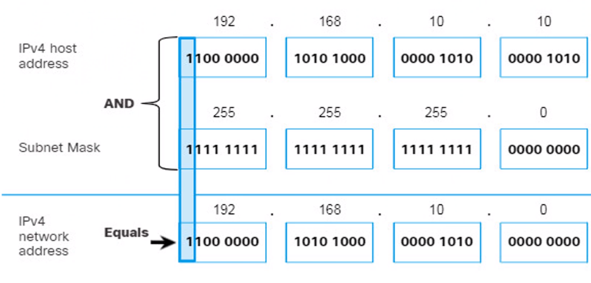

# Addressing Standards

In computing, several different addresses are required in order to communicate in different ways. IP addresses can be utilized in order to identify any machine on the same network, or outside, whereas a MAC address can only be used to identify and communicate with a machine on the same network. In addition to this, ports are utilized to further organize incoming communications on an individual machine.

## Positional Numeral Systems

A positional system / notation is the system used to write / express a number. Positional notation means that a digit represents different values depending on the position the digit occupies in the sequence of numbers.

In networking, three numeral systems are used:
- Binary Numeral System (base 2)
  - Binary is often used in computing as 1 or 2 can also be seen as on or off in terms of transistors in a machine.
- Decimal Numeral System (base 10)
- Hexadecimal Numeral System (base 16)

## Data-Link (2nd Layer) Addressing

Addressing on this layer is done using a Media Access Control (MAC) address, also known as the physical address (this is similar to a serial number.) A MAC-address is a global unique address that is tied to the Network Interface Card (NIC). The MAC-address is formed out of 48-bits, written as a 12-digit colon-hexadecimal number (equal to 6 bytes / octets.)

MAC-addresses are not routable and will not be visible outside of your network, and are therefore it is only used for communication on the same network. MAC-addresses are read-only and are not modifiable on the NIC, however many system OS allow you to configure an alternative MAC-address. A NIC's MAC-addresses first 6-digits will represent the manufacturer, called an Organizational Unique Identifier (OUI), and the second 6-digits will represent the device itself, known as a Device Identifier.

## Network (3rd Layer) Addressing

An Internet Protocol (IP) Address is the address used to identify a host on any TCP/IP network. IP address is a part of the IP protocol in the Network Layer.

There are currently two versions of IP addresses:
- IPv4
  - IPv4 addresses are a series of only 1s and 0s (binary)
  - All network devices use binary IPv4 addressing to identify each other, however a decimal format is often used to represent an IPv4 address as it's easier for user-readability
  - There are a finite amount of IPv4 addresses. They are limited by 0.0.0.0 up to 255.255.255.255
- IPv6

An IPv4 address is a 32-bit hierarchical address that is made up of:
- A network portion
- A host portion

When determining the network portion versus the host portion, you must look at the 32-bit stream.

There are two systems utilized to recognize the network portion from the host portion:
- Legacy Classful Addressing
- Classless (Subnet-based System)

### Legacy Classful Addressing

In a Legacy Classful Addressing system there are five different classes (A - E) used to represent different groups of IP addresses. For each class, there is a different requirement of how many bits need to be identified in order to identify the network portion from the host portion.

- Class A = 0.0.0.0 to 127.255.255.255 (0) - The first octet is used to identify the network portion of the address.
- Class B = 128.0.0.0 to 191.255.255.255 (10) - The first two octets are used to identify the network portion of the address.
- Class C = 192.0.0.0 to 223.255.255.255 (110) - The first three octets are used to identify the network portion of the address.
- Class D = 224.0.0.0 to 239.255.255.255 (1110) - The class D addresses can be assigned in order to use multicast.
- Class E = 240.0.0.0 to 255.255.255.255 (1111) - The class E addresses are experimental addresses and are not intended to be used.

The first and last IP address in a network will not be utilized by an individual machine as 0.0.0.0 addresses the entire network, and 255.255.255.255 is used in order to broadcast.

### Subnet Mask

When assigning an address to a host, both a IPv4 address and a subnet mask are required. A subnet mask is used in order to identify the network / host portion of the IPv4 address.

When using a subnet mask to determine the network / host portion, if the host portion is 00000000, this will be the network address, whilst 11111111 will be the broadcast address.

#### Classless Inter-Domain Routing (CIDR)

CIDR is a system used to convey subnet masks in a simpler form. The CIDR value is the number of 1's in the subnet mask and represents the network portion of an IP.

IP: 192.168.1.1, Mask: 255.255.255.0 = 192.168.1.1/24 (The '24' indicates the total bytes from the subnet mask)

## Special Use IPv4 Address

| Name                 | Networks                     | Subnet Mask        | Objective                                                                                                                                                                        |
|----------------------|------------------------------|--------------------|----------------------------------------------------------------------------------------------------------------------------------------------------------------------------------|
| Loopback Addresses   | 127.x.x.x                    | 255.0.0.0 or /8    | A special address used by a host in order to address traffic to itself.                                                                                                          |
| Link-Local Addresses | 169.254.0.0                  | 255.255.0.0 or /16 | Known as the Automatic Private IP Addressing (AIPA) are self-assigned IP addresses when a static IP is not set and a dynamic IP is not available.                                |
| Private IP Addresses | 10.0.0.0                     | 255.0.0.0 or /8    | Reserved for usage in private networks (i.e. homes or offices). These IP addresses are used exclusively on the local network, and therefore can be utilized on multiple networks |
| Private IP Addresses | 172.16.0.0 -> 172.31.0.0     | 255.240.0.0 or /12 | Cannot be routed on the Internet (public network)                                                                                                                                |
| Private IP Addresses | 192.168.0.0 -> 192.168.255.0 | 255.255.0.0 or /16 | They can be used by anyone in any network.                                                                                                                                       |
