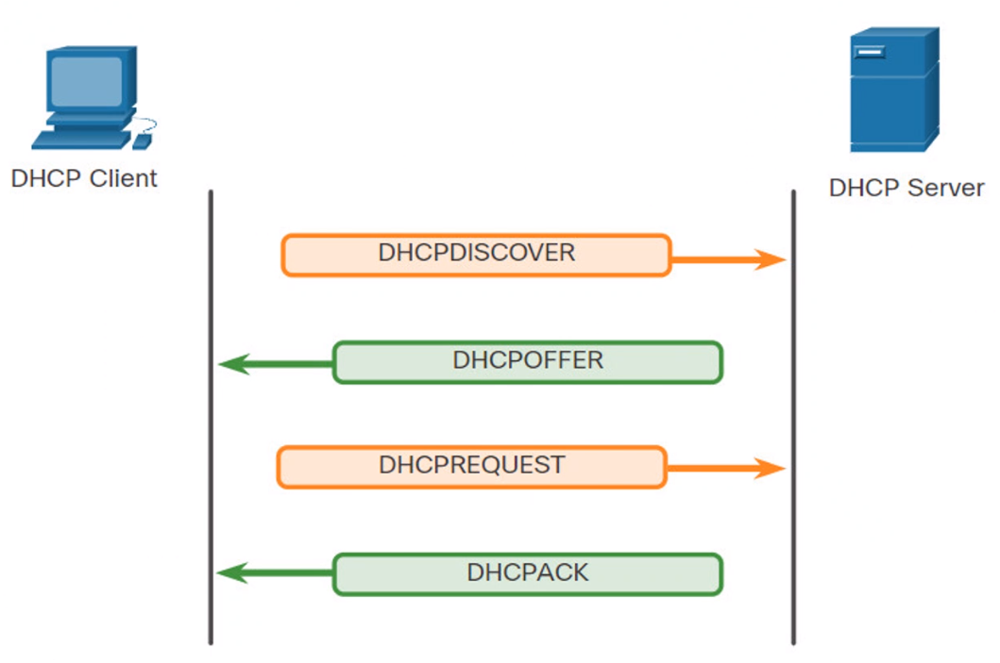

# Application Layer

## Dynamic Host Control Protocol (DHCP)

Dynamic Host Control Protocol is a tool used for the automation of the assignment of IP addresses, subnet masks, gateways and other IP networking parameters. When a host is connected to the network, the DHCP is indirectly contacted and an address is requested. The DHCP server will select and lease an IP address for the host from a pre-selected pool of IP addresses. DHCP servers can be run from different machines, such as a PC or Wireless Access Point. DHCP utilizes the broadcast functionality in order to assign IP addresses to hosts on it's broadcast domain. Despite routers not responding to broadcasts, DHCP relay can be used by the router to unicast a response to a machine. The DHCP protocol utilizes UDP (port 67 and 68) in order to send requests as there may not always be a DHCP server present on the network, so waiting for a response would be unnecessary.

The client will broadcast to discover a DHCP server when connecting to a network, due to the fact it is unfamiliar with the network and will not have it's own IP assigned yet or know of the DHCP server's IP address. Once communication is established, the DHCP server will continue to broadcast back to the client, as the client will still require an IP address for unicast.

## Hypertext Transfer Protocol (HTTP)

Hypertext Transfer Protocol is an application-layer protocol that is used for transmitting hypermedia documents, such as Hyper Text Markup Language (HTML). HTTP is designed for communication between web browsers and web servers, but can also be used for other purposes. HTTP uses a classic client-server model, with the client opening a connection to make a request, then proceeding to wait for a response. HTTP is a stateless protocol, which means the server does not store any data (state) between two requests. HTTP works on port 80/TCP by default, but can work on any other port (like all application protocols).

### Hypertext Transfer Protocol Secure (HTTPs)

Hypertext Transfer Protocol Secure (HTTPs) is a secure version of HTTP that utilizes the SSL / TLS (Secure Socket Login / Transport Layer Security) protocol for encryption and authentication purposes. HTTPs uses port 443/TCP by default. HTTPs protocol makes it possible for website users to transmit sensitive data as their data will be encrypted rather than plain-text.

## File Transfer Protocol (FTP)

File Transfer Protocol is a standard Internet protocol for transmitting files between computers over a TCP connection. FTP uses port 21/TCP, but may also use port 20/TCP if it is running in active mode. FTP is a client-server protocol meaning a client will request a file before the server delivers it. FTP can also be used in conjunction with SSL or SSH in the form of FTP Secure / FTP SSL (FTPS) or SSH FTP (SFTP).

### Domain Name System (DNS)

Domain names were created to convert the numeric address into a simple, recognizable name. This is helpful as the domain will remain the same for the user despite any adjustments to IP addresses as long as the new IP is attached to the domain.

## Email System

Electronic mail (email) is the method of exchanging messages across computers. Email is a client-server method of communication. The three main options utilized are: SMTP, IMAP and POP3.
