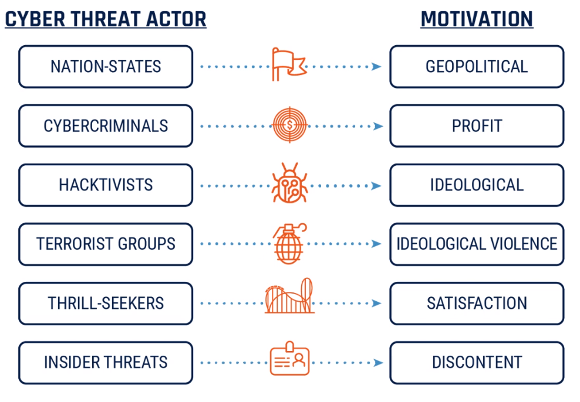

# Introduction to Cybersecurity

Cybersecurity is:
1. The prevention of damage to, as well as the protection of and restoration of computers, electronic communication systems, services, wires

3. Including the information contained within these systems

4. To ensure its availability, integrity, authentication, confidentiality, and non-repudiation

The cybersecurity cube is a model framework used in order to ensure the safety of an organization.
This works by focusing on three goals, safeguards and data states

**Goals:**
- Confidentiality – Unauthorized access should be prevented
- Integrity – Data should remain intact and untampered
- Availability – Accessibility should not be unavailable to authorized users in a reasonable time

**Data States:**
- Storage – Or, Data at Rest (DAR) is data in an information system, such as that stored on memory, a magnetic tape or disk.
- Transmission – Transferring data between two systems, also known as Data in Transit (DAT)
- Processing – Performing operation on data in order to achieve a desired objective

**Safeguards:**
- Policies & practices – administrative controls, also referred to as operations
- Human factors – Considering how users will behave around a system or any potential human errors that could occur, also referred to as personnel
- Technology – Software and hardware-based solutions

**Causes of vulnerabilities include:**
- Design and development errors
- Poor system configuration
- Humar errors
- Connectivity
- Complexity
- Passwords
- User input
- Management
- Lack of training  
- Communication

## Cyber Attacks

Two main forms of cyber-attacks are un-targeted cyber-attacks and targeted cyber-attacks.

*(Cyber threat actors without motivation could include natural disiasters, or could come down to human error. Cyber threat actors do not include white hat or ethical hackers.)*

**Cyber Threat Surface** is all available endpoints that a threat actor may attempt to exploit in Internet-connected devices within the cyber threat environment. The many processes that produce, deliver and rely on information systems connected to the internet are also potential threat vectors and targets.

### Cyber Kill Chain

